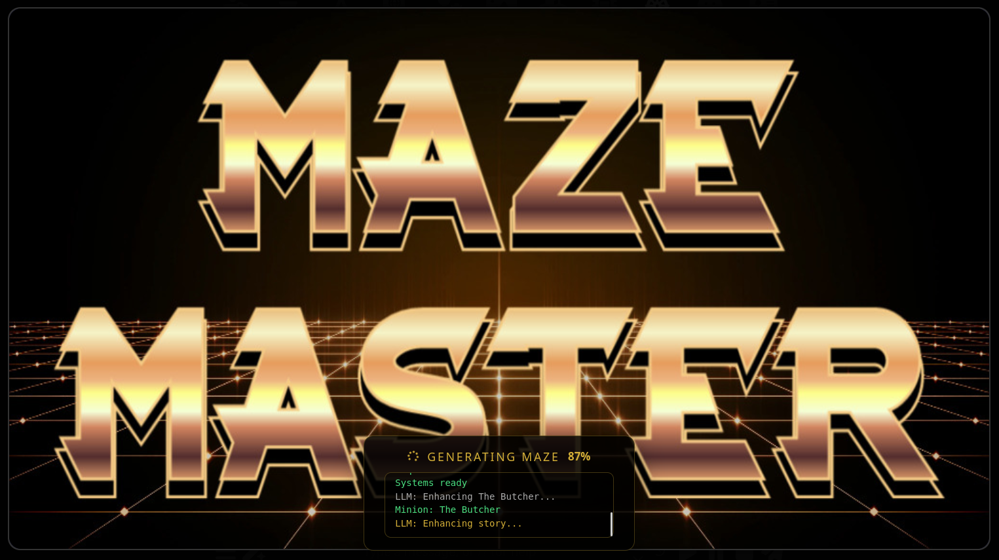
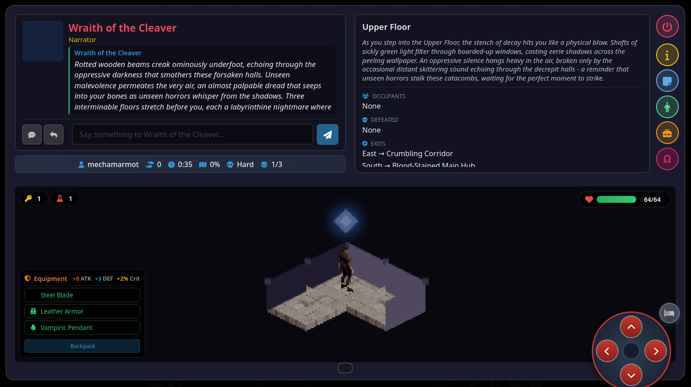

# MazeMaster

<p align="center">
  
</p>

A **Roguelike RPG Adventure Toolkit** for SillyTavern featuring procedurally generated dungeons, LLM-enhanced narration, 8 combat mini games, and full inventory management.

**Author:** mechamarmot

<p align="center">
  
</p>
<p align="center"><em>Isometric dungeon crawling with LLM-enhanced narration and character chat</em></p>

---

## What's New (v1.9.0 - v2.0.x)

### v2.0.x - Interactive Storytelling & Equipment

**Interactive Storytelling with LLM**
- **Chat with Characters** - Send messages to minions and NPCs during encounters
- **Response Generation** - Generate creature/narrator replies using your LLM
- **Impersonate Mode** - Generate messages as your character for roleplay
- **Truly Unique Playthroughs** - LLM-generated minion names and starting messages

**Equipment System**
- **Equipment Modal** - Dedicated UI for weapons, armor, accessories
- **Durability & Charges** - Equipment degrades, charges deplete with use
- **Repair & Breaking** - Repair kits restore gear; damaged items can break

**Loading Screen Progress**
- Real-time console showing all generation steps
- Progress percentage during maze and LLM phases

**Dynamic Profile Settings**
- Vision, combat, faction settings per profile
- Configurable XP rates per difficulty

---

### v1.9.0 - Help System & Dynamic Registries

**Comprehensive Help Tab**
- **Three organized sub-tabs**: Commands, Macros, STScript Hooks
- All 22 slash commands documented with usage examples
- 30+ hooks with complete parameter reference
- Full macro documentation with examples

**Dynamic Profile Registries**
- Themes, difficulties, map styles auto-populate from profiles
- Slash commands validate against actual available options
- UI dropdowns generate dynamically - custom profiles appear automatically
- Eliminated all hardcoded item, theme, and difficulty data

**STScript Macro System**
```
{{roll:2d6+3}}     → Dice roll with modifier (5-15)
{{roll:1d20}}      → Standard d20 roll (1-20)
{{random:50:100}}  → Random number in range (50-100)
```

**Testing Infrastructure**
- 237 unit tests covering all game mechanics
- STScript hook tests verify macro substitution
- Integration tests for hook parameter validation

---

### v1.8.0 - Equipment & Progression Systems

**Equipment System**
- **3 equipment slots**: Weapon, Armor, Accessory
- Equipment drops from combat victories
- Attack/Defense bonuses affect combat
- Rarity tiers: Common, Uncommon, Rare, Epic, Legendary
- STScript hooks: `onEquip`, `onUnequip`, `onEquipmentFound`

**XP & Leveling**
- Gain XP from combat, exploration, and quest completion
- Level-up grants skill points for character customization
- STScript hooks: `onXpGain`, `onLevelUp`

**Skill Trees**
- Multiple skill trees per theme
- Skills unlock at specific levels
- Skill ranks improve effectiveness
- STScript hooks: `onSkillLearn`, `onSkillUse`

**Quest Profile System**
- Link quest profiles to maze profiles
- Quest-gated zones replace room-clearing progression
- Multi-step quests with progression tracking
- STScript hooks: `onQuestComplete`, `onQuestProgression`

---

### v1.6.0 - 248 Themed Encounter Profiles

**Complete Profile Redesign**
Every encounter type now has **31 themed profiles**:
- 1 Tutorial Profile (theme-agnostic, teaches mechanics)
- 30 Theme × Difficulty Profiles (6 themes × 5 difficulties)

**6 Themes**
- Fantasy, Horror, Sci-Fi, Cyberpunk, Western, Action
- Theme-specific NPCs, enemies, and flavor text
- Unique boss encounters per theme

**6-Tier Difficulty System**
| Tier | Floors | Zones | Combat | Permadeath |
|------|--------|-------|--------|------------|
| Tutorial | 1 | 1 | None | No |
| Easy | 1 | 2 | Simple | No |
| Normal | 2 | 3 | Default | Optional |
| Hard | 3 | 4 | Default | Optional |
| Nightmare | 4 | 4 | Aggressive | Required |
| Apocalypse | 5 | 5 | Lethal | Required |

**STScript-Powered Encounters**
- All 248 profiles include proper hooks
- Rewards scale with difficulty: `/mazeitem`, `/mazeheal`
- Punishments scale with difficulty: `/mazedamage`
- Narrative feedback via `/echo`

---

### v1.5.0 - Combat Mechanics & Fairness

**Combat Mechanics Profiles**
- Configurable combat rules per difficulty
- Damage multipliers, hit chances, flee penalties
- Enemy AI behavior settings

**Fairness/Pity System**
- Key pity: Guaranteed key after N chests without one
- Healing pity: Increased healing drops at low HP
- Mercy unlock: Locked chests auto-unlock after being skipped
- All thresholds configurable per profile

**Session Memory**
- Adventure events stored for LLM context
- "Session Notes" button shows current memory
- Influences room descriptions and NPC dialogue

**LLM Room Enhancement**
- Dynamic room descriptions on first entry
- Theme-aware narrative generation
- Configurable prompt templates

<details>
<summary>Earlier Versions (v1.3 - v1.4)</summary>

**v1.4.x**
- BSP Dungeon Generation for all map styles
- Themed Room Types (treasureVault, arena, library, etc.)
- Zone Progression System - Metroidvania-style unlocks
- Secret Passages with hint-based discovery

**v1.3.x**
- 6 Combat Modes: Turn-based, QTE, Dice, Stealth, Puzzle, Negotiation
- HP System with damage/heal mechanics
- 5 Vision Items with dynamic fog of war
- Battlebar 1-10 Difficulty scaling
</details>

---

## Installation

### Via SillyTavern Extension Manager (Recommended)

1. Open SillyTavern and navigate to **Extensions** > **Install Extension**
2. Enter the repository URL: `https://github.com/mechamarmot/SillyTavern-MazeMaster`
3. Click **Install** and refresh SillyTavern

### Manual Installation

1. Clone or download this repository
2. Copy the folder to: `SillyTavern/public/scripts/extensions/third-party/`
3. Restart SillyTavern

---

## The Maze

The heart of MazeMaster is a complete dungeon-crawling adventure. Players navigate procedurally generated mazes, encountering minions, opening chests, avoiding traps, and reaching the exit.

<table>
<tr>
<td align="center"><br><em>Classic Top-Down View</em></td>
<td align="center"><br><em>Isometric 2.5D Rendering</em></td>
</tr>
<tr>
<td align="center"><br><em>Multi-Floor Exploration</em></td>
<td align="center"><br><em>Fog of War System</em></td>
</tr>
</table>

### Features

- **LLM-Enhanced Narration** - Dynamic room descriptions generated by your LLM
- **Session Memory** - Adventure events influence future narration
- **Procedural Generation** - Every maze is unique (5x5 to 20x20 grids)
- **Multi-Floor Dungeons** - Staircases connect multiple levels with Floor Keys
- **Isometric Renderer** - Beautiful 2.5D view with Kenney sprite support
- **Fog of War** - Tiles reveal as you explore; use Map Fragments for intel
- **HP System** - Track health with potions, damage, and revival mechanics
- **8 Mini Games** - Combat, puzzles, stealth, and social encounters
- **Fairness System** - Pity mechanics prevent unlucky streaks
- **6 Difficulty Tiers** - Tutorial, Easy, Normal, Hard, Nightmare, Apocalypse

### Minion Types

| Type | Behavior |
|------|----------|
| **Messenger** | Displays story text, hints, or lore |
| **Battlebar** | Triggers timing-based combat challenge |
| **Prize Wheel** | Spin for randomized rewards |
| **Merchant** | Buy/sell items from configurable pools |
| **Turn-Based** | RPG combat with Attack/Defend/Item/Flee |
| **QTE** | Quick-time event key presses |
| **Dice** | Roll against a target number |
| **Stealth** | Sneak past with Advance/Hide/Distract |
| **Puzzle** | Sequence or memory challenge |
| **Negotiation** | Social encounter with Persuade/Bribe |

### Items (20 Total)

| Category | Items |
|----------|-------|
| **Core** | Key (unlock chests), Stealth (skip encounter), Strike (guaranteed hit), Execute (instant win) |
| **Exploration** | Floor Key (stairs), Portal Stone (teleport), Map Fragment (reveal 3x3), Void Walk (phase through wall) |
| **Combat** | Minion Bane (skip combat), Time Shard (extra move) |
| **HP** | Healing Potion (25%), Greater Healing (50%), Elixir (100%), Revival Charm (auto-revive), Heart Crystal (+10 max HP) |
| **Vision** | Torch (+2 visibility for 3 moves), Lantern (+1 passive), Reveal Scroll (full floor), Sight Potion (+1 permanent), Crystal Ball (reveal minions) |

---

## Mini Games

MazeMaster includes **8 modular mini games** that can be used standalone or within mazes.

<table>
<tr>
<td align="center"><br><em>Turn-Based Combat</em></td>
<td align="center"><br><em>QTE Challenge</em></td>
<td align="center"><br><em>Dice Roll</em></td>
</tr>
<tr>
<td align="center"><br><em>Stealth Encounter</em></td>
<td align="center"><br><em>Puzzle Challenge</em></td>
<td align="center"><br><em>Negotiation</em></td>
</tr>
<tr>
<td align="center"><br><em>Prize Wheel</em></td>
<td align="center"><br><em>Battlebar</em></td>
<td></td>
</tr>
</table>

| Game | Slash Command | Description |
|------|---------------|-------------|
| **Battlebar** | `/battlebar profile="Name"` | Timing-based - hit the green zone |
| **Prize Wheel** | `/wheel profile="Name"` | Spin-to-win with weighted segments |
| **Turn-Based** | `/turnbased profile="Name"` | RPG combat with Attack/Defend/Item/Flee |
| **QTE** | `/qte profile="Name"` | Quick-time events - press keys as prompted |
| **Dice** | `/dice profile="Name"` | Roll dice against a target number |
| **Stealth** | `/stealth profile="Name"` | Sneak past guards |
| **Puzzle** | `/puzzle profile="Name"` | Sequence/memory puzzles |
| **Negotiation** | `/negotiate profile="Name"` | Social encounters |

---

## Slash Commands Reference

### Game Commands

| Command | Description |
|---------|-------------|
| `/maze [profile="name"]` | Start a maze using specified profile |
| `/wheel [profile="name"]` | Open the prize wheel |
| `/battlebar [profile="name"]` | Start battlebar challenge |
| `/turnbased [profile="name"]` | Start turn-based combat |
| `/qte [profile="name"]` | Start QTE challenge |
| `/dice [profile="name"]` | Start dice roll challenge |
| `/stealth [profile="name"]` | Start stealth encounter |
| `/puzzle [profile="name"]` | Start puzzle challenge |
| `/negotiate [profile="name"]` | Start negotiation |

### Maze Info Commands

| Command | Description |
|---------|-------------|
| `/mazestats` | Get maze statistics as JSON |
| `/mazeexplore` | Get exploration percentage (0-100) |
| `/mazeobjective [id="name"]` | Get objective progress |
| `/mazefloor` | Get current/total floor info |
| `/mazepersonastats [persona="x"]` | Get stats for a persona |

### Maze Settings Commands

| Command | Description |
|---------|-------------|
| `/mazedifficulty [tier="x"]` | Get/set difficulty (easy/normal/hard/nightmare) |
| `/mazetheme [theme="x"]` | Get/set theme (fantasy/horror/scifi/action) |
| `/mazemapstyle [style="x"]` | Get/set map style (maze/dungeon/city/forest/spaceship) |
| `/mazeminion [name="x"] [message="x"]` | Set minion display in active maze |

### HP System Commands

| Command | Description |
|---------|-------------|
| `/mazehp [set=N]` | Get HP status as JSON, or set HP to value |
| `/mazeheal [amount=N] [percent=true]` | Heal player (absolute or % of max) |
| `/mazedamage [amount=N] [source="x"]` | Deal damage with optional source |

### Inventory Commands

| Command | Description |
|---------|-------------|
| `/mazeitem action="add" item="x" [amount=N]` | Add item(s) to inventory |
| `/mazeitem action="remove" item="x" [amount=N]` | Remove item(s) from inventory |
| `/mazeitem action="list"` | List all available items with IDs |

---

## Macros

Macros are processed in STScript hooks before execution. Use them for dynamic values.

### Dice Roll Macro

```
{{roll:XdY+Z}}
```

Rolls X dice with Y sides and adds Z modifier.

| Example | Result Range |
|---------|--------------|
| `{{roll:1d6}}` | 1-6 |
| `{{roll:2d6}}` | 2-12 |
| `{{roll:1d20}}` | 1-20 |
| `{{roll:2d6+3}}` | 5-15 |
| `{{roll:1d8-2}}` | -1 to 6 |
| `{{roll:3d10+5}}` | 8-35 |

**Usage in hook:**
```
/echo Dealt {{roll:2d6+3}} damage!
```

### Random Number Macro

```
{{random:MIN:MAX}}
```

Generates random integer between MIN and MAX (inclusive).

| Example | Result Range |
|---------|--------------|
| `{{random:1:10}}` | 1-10 |
| `{{random:50:100}}` | 50-100 |
| `{{random:0:1}}` | 0 or 1 (coin flip) |

**Usage in hook:**
```
/echo Found {{random:10:50}} gold coins!
```

### Combining Macros

Use multiple macros and template variables together:

```
/echo {{source}} deals {{roll:2d6}} damage!
/setvar key=loot value={{random:1:100}}
/echo Roll: {{roll:1d20}} | Gold: {{random:10:50}}
```

---

## STScript Hooks

Hooks are STScript commands that fire on game events. Configure them in profile settings.

### Movement Hooks

| Hook | Variables | Description |
|------|-----------|-------------|
| `onMove` | `{{x}}`, `{{y}}`, `{{direction}}` | Fires when player moves |
| `onTeleport` | `{{x}}`, `{{y}}`, `{{source}}` | Fires on teleport |

### HP System Hooks

| Hook | Variables | Description |
|------|-----------|-------------|
| `onDamage` | `{{amount}}`, `{{source}}`, `{{hp}}`, `{{maxHp}}` | Fires on damage taken |
| `onHeal` | `{{amount}}`, `{{source}}`, `{{hp}}`, `{{maxHp}}` | Fires on heal |
| `onPlayerDeath` | `{{source}}` | Fires when HP reaches 0 |

### Item Hooks

| Hook | Variables | Description |
|------|-----------|-------------|
| `onItemAdd` | `{{item}}`, `{{count}}`, `{{total}}` | Item added to inventory |
| `onItemRemove` | `{{item}}`, `{{count}}`, `{{total}}` | Item removed/used |
| `onChestOpen` | `{{x}}`, `{{y}}`, `{{loot}}` | Chest opened |

### Equipment Hooks

| Hook | Variables | Description |
|------|-----------|-------------|
| `onEquip` | `{{itemId}}`, `{{name}}`, `{{slot}}`, `{{attack}}`, `{{defense}}` | Item equipped |
| `onUnequip` | `{{itemId}}`, `{{name}}`, `{{slot}}` | Item unequipped |
| `onEquipmentFound` | `{{itemId}}`, `{{name}}`, `{{slot}}`, `{{rarity}}` | Equipment dropped |

### Progression Hooks

| Hook | Variables | Description |
|------|-----------|-------------|
| `onXpGain` | `{{amount}}`, `{{source}}`, `{{totalXp}}`, `{{level}}` | XP gained |
| `onLevelUp` | `{{newLevel}}`, `{{skillPointsAvailable}}`, `{{stats}}` | Level up |
| `onSkillLearn` | `{{skillId}}`, `{{skillName}}`, `{{rank}}`, `{{tree}}` | Skill learned |
| `onSkillUse` | `{{skillId}}`, `{{skillName}}`, `{{rank}}`, `{{effect}}` | Skill used |

### Objective Hooks

| Hook | Variables | Description |
|------|-----------|-------------|
| `onObjectiveProgress` | `{{objectiveId}}`, `{{current}}`, `{{target}}` | Progress made |
| `onObjectiveComplete` | `{{objectiveId}}` | Objective completed |
| `onAllObjectivesComplete` | (none) | All objectives done |
| `onExploreComplete` | `{{percentage}}` | 100% exploration |

### Enemy Hooks

| Hook | Variables | Description |
|------|-----------|-------------|
| `onEnemyMove` | `{{minionId}}`, `{{x}}`, `{{y}}`, `{{state}}` | Minion moves |
| `onMinionAlert` | `{{minionId}}`, `{{x}}`, `{{y}}`, `{{alertLevel}}` | Minion alerted |
| `onRoomClear` | `{{roomId}}`, `{{roomType}}`, `{{x}}`, `{{y}}` | Room cleared |

### Combat Mode Hooks

| Hook | Variables | Description |
|------|-----------|-------------|
| `onTurnStart` | `{{turn}}` | Combat turn starts |
| `onAttack` | `{{attacker}}` | Player attacks |
| `onDefend` | `{{defender}}` | Player defends |
| `onPlayerHit` | `{{damage}}` | Player hits enemy |
| `onEnemyHit` | `{{enemy}}`, `{{damage}}` | Enemy hits player |
| `onWin` | (none) | Combat won |
| `onLose` | (none) | Combat lost |
| `onFlee` | (none) | Player fled |

### Example Hook Configuration

```
onWin: /mazeitem action="add" item="key" | /mazeheal amount=20 | /echo Victory!
onLose: /mazedamage amount=10 | /echo Defeated...
onDamage: /echo Took {{amount}} damage from {{source}}! HP: {{hp}}/{{maxHp}}
```

---

## Configuration

<table>
<tr>
<td align="center"><br><em>Maze Profile Configuration</em></td>
<td align="center"><br><em>Wheel Segment Setup</em></td>
</tr>
</table>

| Tab | Purpose |
|-----|---------|
| **Maze** | Grid size, encounters, chests, loot, milestones, LLM settings, fairness |
| **Wheel** | Segment text, sizes, colors, STScript commands |
| **Battlebar** | Difficulty, hit counts, stage images, event hooks |
| **Combat** | Turn-based, QTE, Dice, Stealth, Puzzle, Negotiation profiles |
| **Minions** | Reusable NPC configurations with types and scripts |
| **Traps** | Trap configurations with images and effects |
| **Help** | Commands, Macros, and STScript Hooks reference |

---

## Quick Start

### Option 1: Jump Right In
MazeMaster comes with **31 pre-built maze profiles**. Open the extension panel, select a profile, and click **Play**.

**Recommended:** Start with `Tutorial - Learn the Basics` or any `Easy` profile.

### Option 2: Test the Mini Games
```
/turnbased profile="Tutorial - Combat Training"
/dice profile="Fantasy - Easy"
/stealth profile="Cyberpunk - Normal"
/puzzle profile="Horror - Hard"
```

### Option 3: Build Your Own
1. **Minions Tab** - Create NPCs
2. **Combat Tabs** - Configure mini game profiles
3. **Maze Tab** - Build a dungeon profile
4. Click **Play** or use `/maze profile="Your Profile"`

---

## Tips

- **LLM Enhancement** works best with descriptive theme names
- **Session Notes** ("m" button) shows what the LLM knows about your adventure
- Use **Intelligent Distribute** to auto-balance encounter percentages
- Chain STScript commands with `|` for complex behaviors
- Test mini games with **Preview buttons** before adding to mazes
- Use `{{roll:XdY}}` macros for dynamic damage/rewards in hooks

---

## License

AGPL-3.0 - See LICENSE file

---

## Support

For issues, feature requests, or contributions, visit the [GitHub repository](https://github.com/mechamarmot/SillyTavern-MazeMaster).
