# MazeMaster

A modular adventure toolkit for SillyTavern featuring procedurally generated mazes, prize wheels, and battle challenges. Create immersive dungeon-crawling experiences with LLM-enhanced narration.

**Author:** mechamarmot

---

## What's New in v1.3.0

- **6 Combat Modes** - Turn-based, QTE, Dice, Stealth, Puzzle, and Negotiation encounters
- **HP System** - Health points with damage/heal mechanics and visual effects
- **15 Inventory Items** - Core (key, stealth, strike, execute), Special (floorKey, portalStone, minionBane, mapFragment, timeShard, voidWalk), and HP items (potions, elixirs, revival charms)
- **Battlebar 1-10 Difficulty** - Continuous difficulty scaling with maze multipliers
- **Factory Defaults System** - Automatic profile updates when new defaults are added
- **Merchant Item Pools** - Configure item pools for merchant encounters
- **Expanded STScript Hooks** - onEncounter, onChest, onTrap events

<details>
<summary>v1.2.1 Changes</summary>

- Isometric Renderer with Kenney sprite support
- Multi-Floor Dungeons with staircases
- Fog of War visibility system
- 12 Default Maze Profiles (Fantasy, Horror, Sci-Fi, Cyberpunk, Western, Action)
- Themed Content Packs for minions, traps, battlebars, and wheels
- Profile Renaming and Auto-Close Victory
</details>

---

## Installation

### Via SillyTavern Extension Manager (Recommended)

1. Open SillyTavern and navigate to **Extensions** > **Install Extension**
2. Enter the repository URL: `https://github.com/mechamarmot/SillyTavern-MazeMaster`
3. Click **Install**
4. Refresh SillyTavern

### Manual Installation

1. Clone or download this repository
2. Copy the folder to: `SillyTavern/public/scripts/extensions/third-party/`
3. Restart SillyTavern

---

## What is MazeMaster?

MazeMaster is a modular game system that brings interactive gameplay elements to SillyTavern. At its core, it's a complete dungeon-crawling experience with procedurally generated mazes, but its components can also be used independently for any purpose.

### The Three Components

| Component | Description |
|-----------|-------------|
| **Maze** | Full dungeon-crawling experience with procedural generation |
| **Prize Wheel** | Spin-to-win wheel with configurable segments and callbacks |
| **Battlebar** | Timing-based combat minigame with hit zones and progression |

---

## Screenshots

<p align="center">
  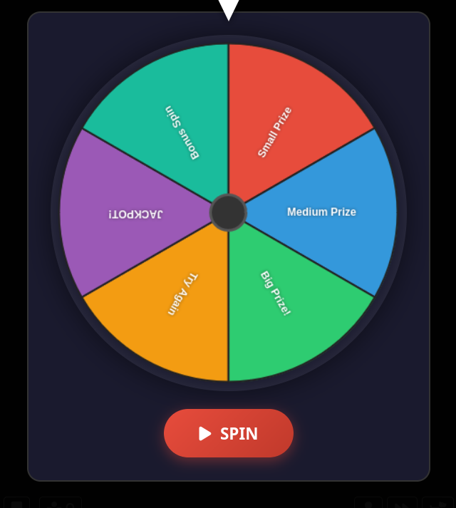
</p>
<p align="center"><em>Prize Wheel - Spin for randomized rewards or events</em></p>

<p align="center">
  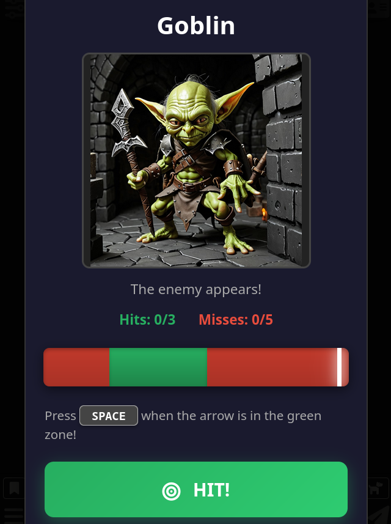
</p>
<p align="center"><em>Battlebar - Time your hits in the green zone to defeat enemies</em></p>

<p align="center">
  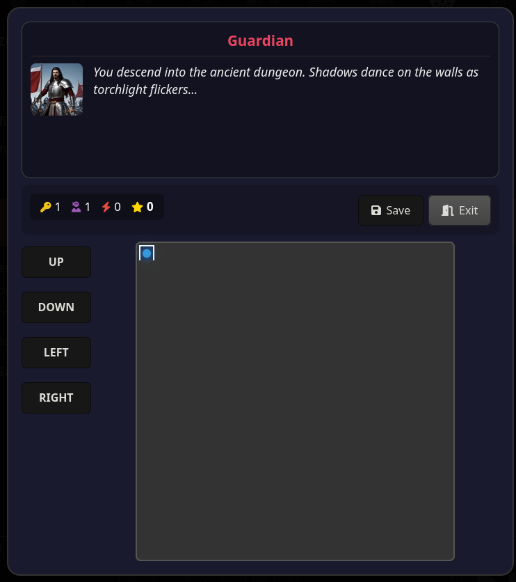
</p>
<p align="center"><em>Maze Gameplay - Explore procedurally generated dungeons with inventory and encounters</em></p>

<p align="center">
  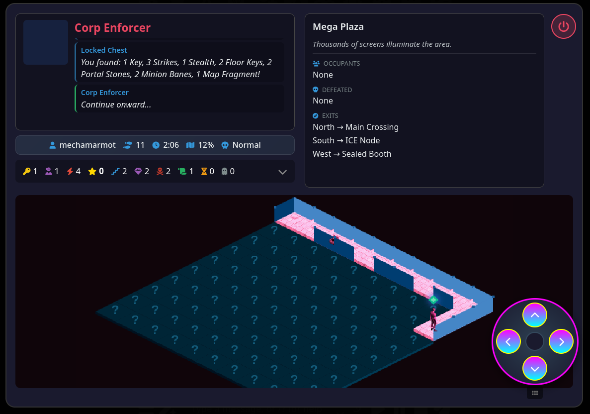
</p>
<p align="center"><em>Isometric View - Beautiful 2.5D rendering with Kenney sprites</em></p>

<p align="center">
  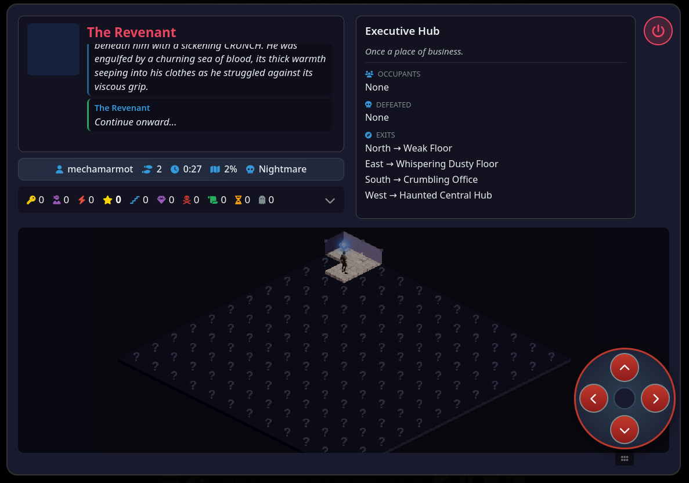
</p>
<p align="center"><em>Isometric Gameplay - Multi-floor dungeons with themed environments</em></p>

<p align="center">
  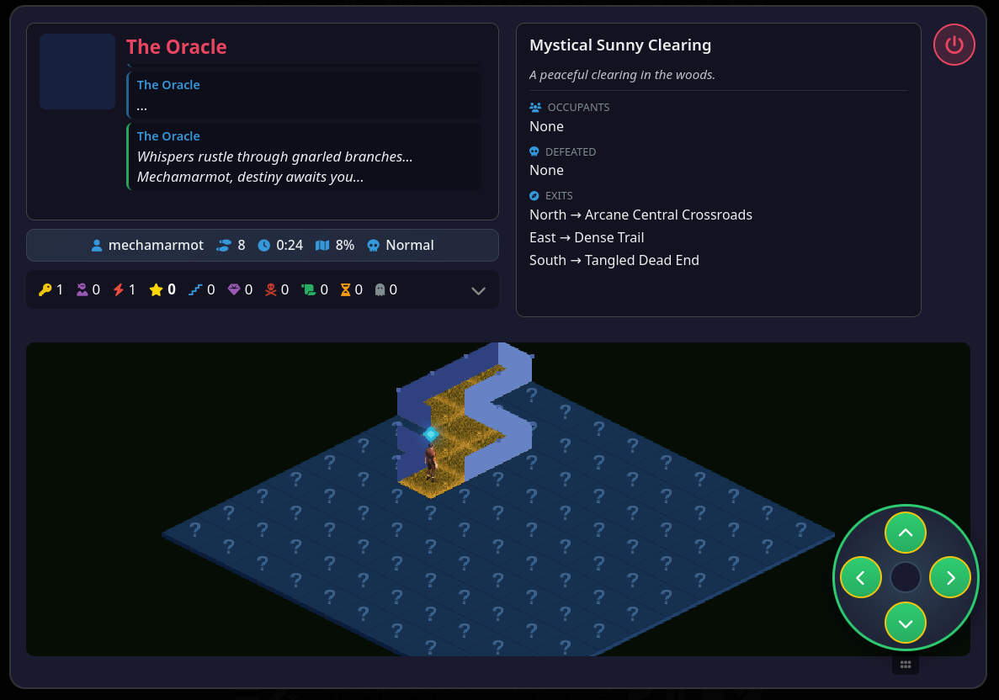
</p>
<p align="center"><em>Fog of War - Tiles reveal as you explore the dungeon</em></p>

### Combat Modes (v1.3.0)

<table>
<tr>
<td align="center">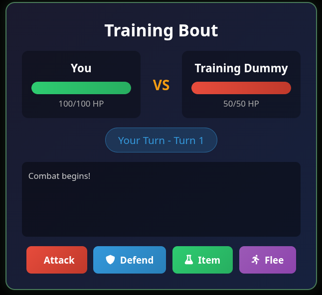<br><em>Turn-Based Combat</em></td>
<td align="center">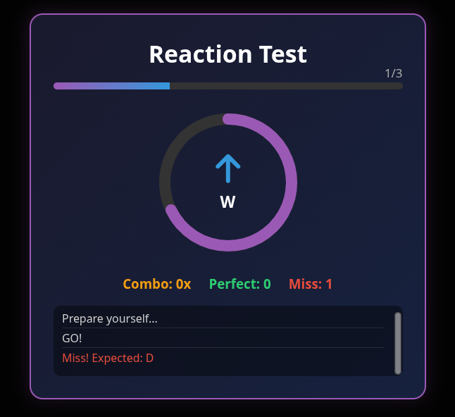<br><em>QTE Challenge</em></td>
<td align="center">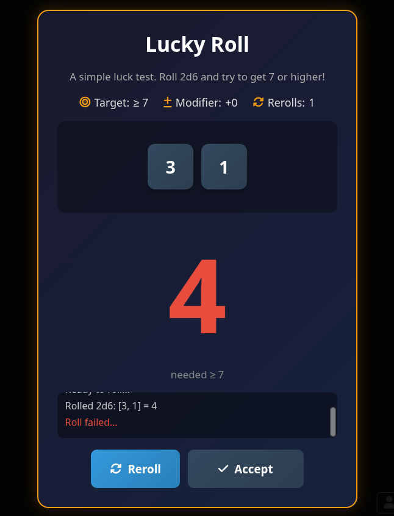<br><em>Dice Roll</em></td>
</tr>
<tr>
<td align="center">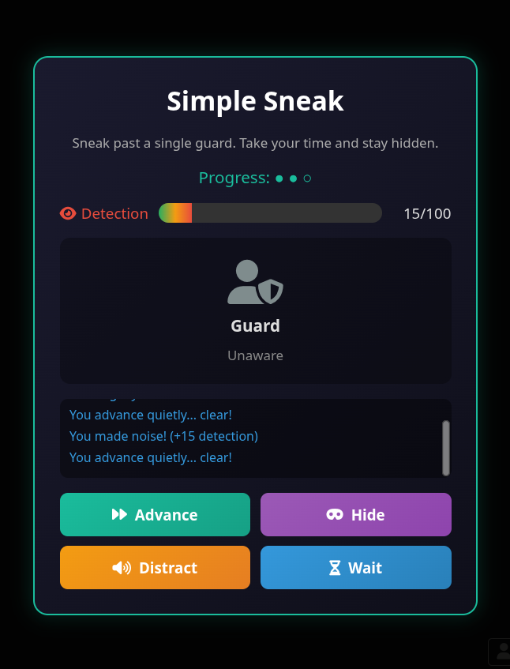<br><em>Stealth Encounter</em></td>
<td align="center">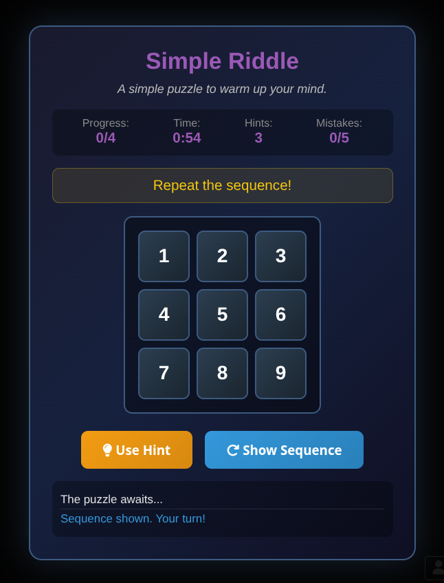<br><em>Puzzle Challenge</em></td>
<td align="center">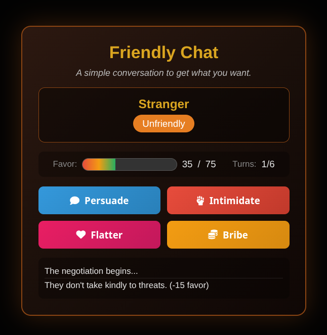<br><em>Negotiation</em></td>
</tr>
</table>

<p align="center">
  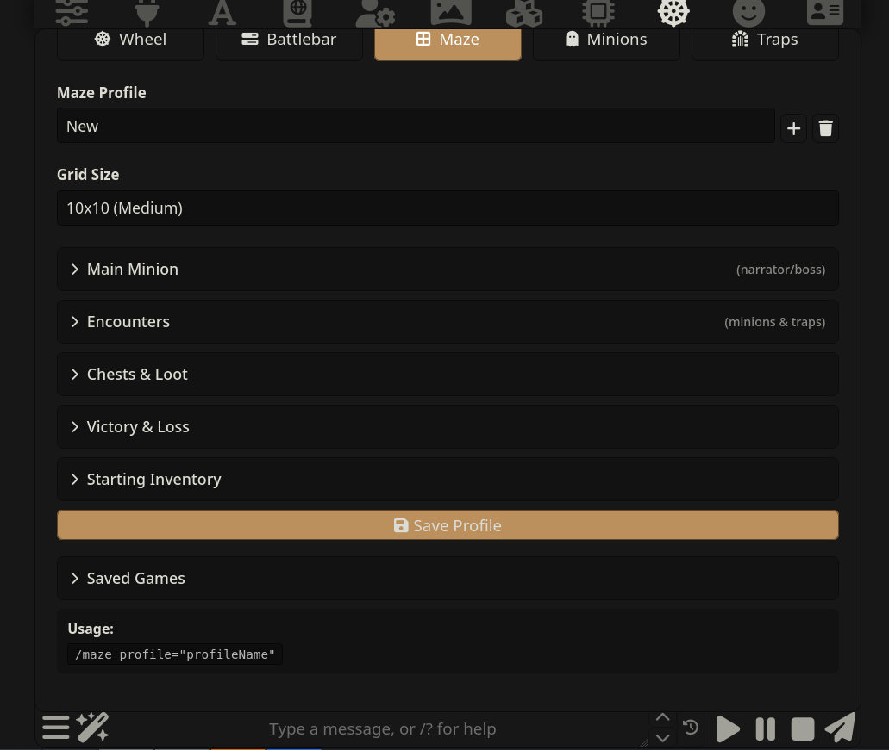
</p>
<p align="center"><em>Maze Configuration - Configure grid size, encounters, chests, and victory conditions</em></p>

<p align="center">
  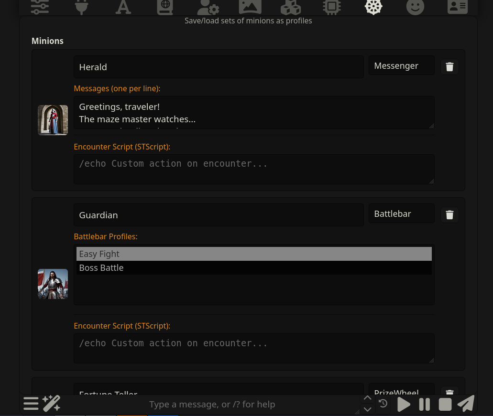
</p>
<p align="center"><em>Minions Configuration - Define messenger, battlebar, wheel, and merchant NPCs</em></p>

<p align="center">
  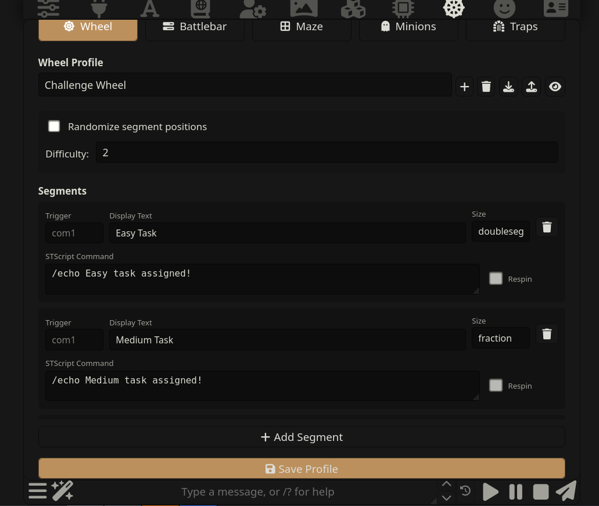
</p>
<p align="center"><em>Wheel Configuration - Set up segments with custom sizes and STScript commands</em></p>

---

## STScript Integration

**MazeMaster is built for STScript integration.** Almost every feature supports STScript callbacks, making it easy to incorporate into character cards, world info, Quick Replies, or other extensions.

### Every Action Can Run Scripts

- **Maze completion** - win/lose runs configurable commands
- **Minion encounters** - run scripts when triggered
- **Trap triggers** - execute scripts when stepped on
- **Chest events** - trigger custom behaviors
- **Wheel segments** - execute commands when landed on
- **Battlebar events** - hit, miss, win, and lose each have command slots

---

## Slash Commands

All components can be triggered via slash commands from anywhere:

| Command | Description |
|---------|-------------|
| `/maze profile="Name"` | Starts the specified maze |
| `/wheel profile="Name"` | Opens the specified wheel profile |
| `/battlebar profile="Name"` | Starts the specified battlebar challenge |
| `/mazeminion name="Name" message="Text"` | Sets minion display in active maze |

---

## Message Macros

MazeMaster supports **message macros** that automatically trigger when they appear in chat:

| Macro | Effect |
|-------|--------|
| `{{maze:ProfileName}}` | Automatically starts the maze |
| `{{wheel:ProfileName}}` | Automatically opens the wheel |
| `{{battlebar:ProfileName}}` | Automatically starts the battlebar |

This allows characters to trigger game events naturally through dialogue:

```
"You dare challenge me? Then face my blade! {{battlebar:Boss Fight}}"
```

---

## Maze (The Complete Experience)

The Maze brings everything together into a complete dungeon-crawling adventure. Players navigate procedurally generated mazes, encountering minions, opening chests, avoiding traps, and reaching the exit.

### Features

- **Procedural Generation** - Every maze is unique (5x5 to 20x20 grids)
- **Minion Encounters** - Configure NPCs that appear on tiles
- **Chest System** - Regular, locked, and mimic chests with loot tables
- **Trap Tiles** - Hazards with custom effects
- **Item System** - Keys, POW, Stealth, and GRANDPOW items
- **Story Milestones** - Narrative beats at exploration percentages
- **Exit Encounters** - Final challenge before escaping

### Minion Types

| Type | Behavior |
|------|----------|
| Messenger | Displays messages only |
| Battlebar | Triggers a combat challenge |
| Prize Wheel | Triggers a wheel spin |
| Merchant | Offers item trades |

### Chest System

- **Regular Chests** - Configurable loot tables with item drop chances
- **Locked Chests** - Require keys, bonus loot percentage
- **Mimics** - Trap chests that trigger consequences

### Items

| Item | Effect |
|------|--------|
| Key | Opens locked chests |
| POW | Guarantees next battlebar hit |
| Stealth | Skips next encounter |
| GRANDPOW | Instantly wins any battlebar |

### Story Milestones

Configure narrative beats based on exploration progress:
- 25% explored: "You're making progress..."
- 50% explored: "Halfway through the maze..."
- 75% explored: "The exit must be close..."

### Exit Encounters

Choose what happens at the maze exit:
- **Messenger** - Final message before victory
- **Battlebar** - Boss fight to escape
- **Prize Wheel** - Final reward spin

---

## Prize Wheel

A fully customizable spin-to-win game for rewards, random events, or any randomized outcome.

### Features
- Unlimited segments per wheel
- Variable segment sizes (weighted probability)
- Respin capability on specific segments
- STScript command per segment

### Segment Configuration

- **Trigger Name** - Identifier for callbacks
- **Display Text** - What shows on the wheel
- **Command** - STScript executed when landed on
- **Size** - `fraction` (1x), `halfseg` (0.5x), or `doubleseg` (2x)
- **Respin** - Whether landing triggers another spin

### Standalone Uses
- Gacha/loot systems
- Random event triggers
- Fortune telling
- Decision making

---

## Battlebar

A timing-based combat minigame where players hit a button when an arrow passes through a target zone.

### Features
- Adjustable difficulty (arrow speed)
- Configurable hits to win / misses to lose
- Stage images with progression
- POW items for guaranteed hits
- GRANDPOW for instant victory

### Event Hooks

Each event can trigger your own STScript:

| Event | When it fires |
|-------|---------------|
| Hit Command | Each successful hit |
| Miss Command | Each missed attempt |
| Win Command | When player wins |
| Lose Command | When player loses |

### Standalone Uses
- Combat encounters
- Skill checks
- Quick-time events
- Boss fights

---

## Configuration Tabs

The MazeMaster settings panel has five tabs:

### Maze Tab
- Create/manage maze profiles
- Set grid size and win/lose conditions
- Configure main minion (narrator)
- Add minion and trap encounters
- Configure chest distribution and loot
- Set starting inventory
- Add story milestones

### Wheel Tab
- Create/manage wheel profiles
- Configure segments
- Set randomization and difficulty
- Preview button to test

### Battlebar Tab
- Create/manage battlebar profiles
- Configure difficulty and hit counts
- Add stage images
- Set STScript commands
- Preview button to test

### Minions Tab
- Create reusable minion configurations
- Set type, images, messages
- Configure encounter scripts

### Traps Tab
- Create trap configurations
- Set images, messages, scripts

---

## LLM Integration

MazeMaster can enhance messages through your connected LLM:

- **Enable LLM** - Toggle AI narration enhancement
- **LLM Preset** - Select which preset to use

When enabled, messages are sent to the LLM with context to generate atmospheric, in-character narration.

---

## Quick Start

1. **Create a few minions** in the Minions tab
2. **Create a battlebar profile** for combat encounters
3. **Create a maze profile** and add your minions as encounters
4. **Click Play** or use `/maze profile="YourProfile"`

Or use components standalone:
```
/wheel profile="Reward Wheel"
/battlebar profile="Quick Fight"
```

---

## Tips

- Use **Intelligent Distribute** to auto-balance encounter percentages
- Set **Random Message Chance** to 15-25% for ambient narration
- Chain STScript commands with `|` for complex behaviors
- Use the **Preview buttons** to test Wheel and Battlebar
- **POW** and **Stealth** are valuable - use strategically!

---

## License

AGPL-3.0 - See LICENSE file

---

## Support

For issues, feature requests, or contributions, visit the GitHub repository.
